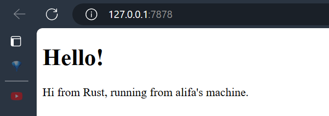
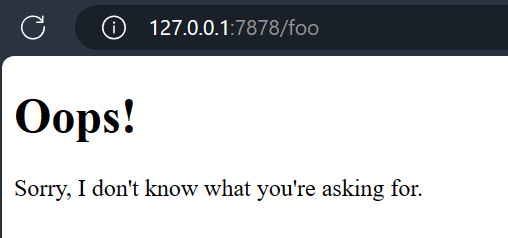

## Commit 1 Reflection
> The handle_connection function reads an incoming TCP stream from a client connection, processing an HTTP request. It uses a BufReader to efficiently read lines from the stream, collecting them into a vector representing the HTTP request. It stops reading once an empty line is encountered, which typically indicates the end of the HTTP request headers. Finally, it prints the collected HTTP request lines to the console. This function is part of a simple TCP server that listens for incoming connections on port 7878 and processes HTTP requests from clients.

## Commit 2 Reflection
> In this updated handle_connection method, after collecting the HTTP request lines, it constructs an HTTP response with a status line, content length, and the contents of a file ("hello.html") read from the file system. It then sends this response back to the client over the TCP stream. This method extends the previous functionality by adding file reading and sending an HTTP response containing the file contents to the client.  

## Commit 3 Reflection
> Before refactoring, there are two separate blocks of code for handling different types of requests ("GET / HTTP/1.1" and others). Each block constructs its own response using hard-coded status lines and file names. In the refactored version, the code has been simplified by using a single block to determine the status line and file name based on the request. This is achieved using a tuple ((status_line, filename)) to store these values. This approach eliminates code duplication and makes it easier to maintain and extend the code in the future.  
> To split the response, the refactored code determines the status_line and filename based on the request line. It then reads the contents of the file specified by filename, calculates its length, and constructs the response string using these values. Finally, it sends the response back to the client over the TCP stream. This refactoring improves the readability and maintainability of the code by reducing duplication and separating concerns.  
